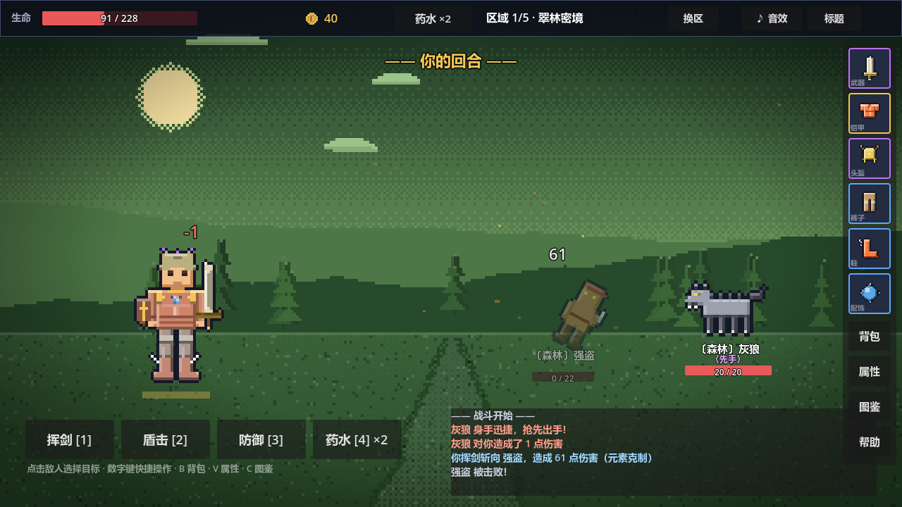
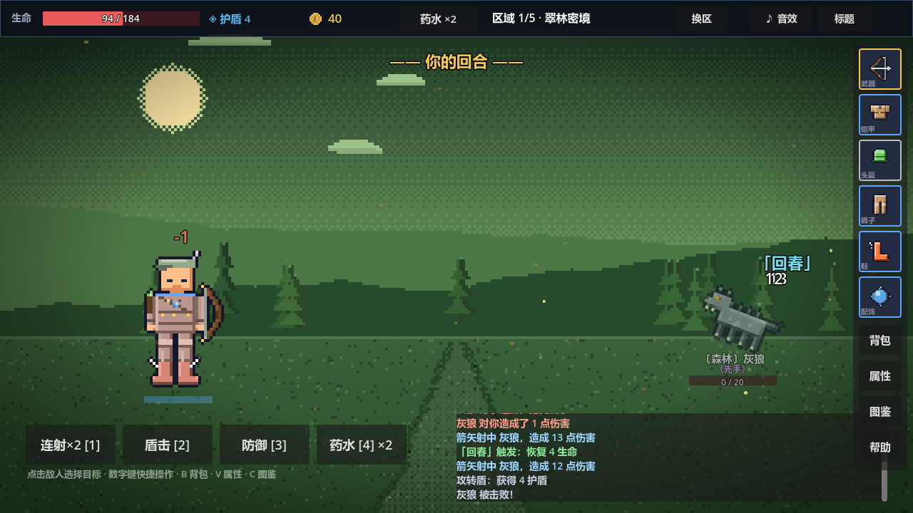
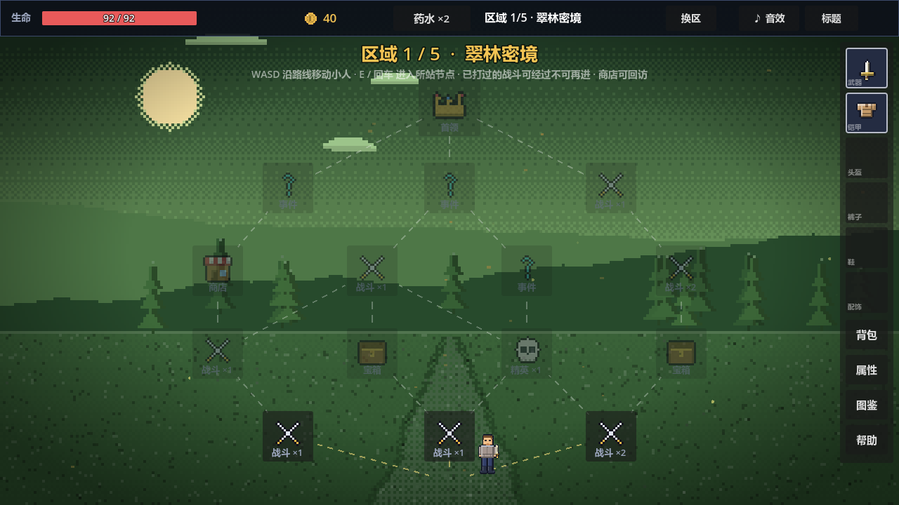

<p align="center">
  
</p>

<h1 align="center">像素探路者 · Pixel Pathfinder</h1>
<p align="center">节点式地图探索 · 回合制战斗 · 装备驱动成长 · 无限周目</p>

一款用 **Godot 4.3** 制作的 2D 像素风回合制 Roguelite。穿越五大区域、用元素克制与装备构筑击败各路怪物与首领，通关后进入无限增强周目。全部美术（角色、怪物、装备图标、区域背景）均由 `scripts/fx/pixel_art.gd` 在运行时程序化合成，音效亦为程序化生成，无外部音频文件。

## 游戏截图 / Screenshots

<p align="center">
  
  
</p>
<p align="center">
  <em>回合制战斗：挥剑触发元素克制（左）；弓每回合两段射击、触发「回春」与「攻转盾」（右）</em>
</p>

<p align="center">
  
</p>
<p align="center"><em>自由选关地图：节点随意点击，进战斗前可先侦察怪物构成</em></p>

剧情演出由 28 张 CG 配合字幕浮现呈现（开场序章、进入区域、击败周目首领等）。

## 五大区域 / Regions

依剧情顺序推进，每个区域有专属元素、群系怪物与区域首领：

| 区域 | 元素 | 群系怪物 | 区域首领 |
| --- | --- | --- | --- |
| 翠林密境 | 森林 | 史莱姆 · 灰狼 · 强盗 | 远古树精 |
| 灼日荒漠 | 大地 | 蝎子 · 木乃伊 · 沙盗 | 陵墓法老 |
| 白雪山岭 | 寒冰 | 雪人 · 幽魂 · 雪狼 | 冰霜巨像 |
| 灰烬火山 | 焰火 | 熔岩怪 · 元素体 · 烈焰蝎 | 熔岩泰坦 |
| 远古遗迹 | 闪电 | 构造体 · 守卫 · 怨灵 | 远古守护者 |

5 个区域开局即全部开放，可任选起点，也可随时「换区」。

## 元素克制 / Elements

五种元素构成相生相克的环（西式设定），武器元素与护甲元素**双向**影响伤害——克制 ×1.3、被克 ×0.8。每种元素附带独特的命中触发效果（默认 22% 概率，每次命中独立判定）：

| 元素 | 克制 | 触发效果 |
| --- | --- | --- |
| 闪电 | 克 森林 | **雷击** — 本次伤害无视护盾且 +15% |
| 森林 | 克 大地 | **回春** — 回复造成伤害 30% 的生命 |
| 大地 | 克 寒冰 | **岩盾** — 获得 6 + 防御 点护盾 |
| 寒冰 | 克 焰火 | **冰缚** — 敌人攻击 -30%，持续 2 回合 |
| 焰火 | 克 闪电 | **引燃** — 点燃敌人，灼烧 2 回合 |

克制环：闪电 → 森林 → 大地 → 寒冰 → 焰火 → 闪电。

## 回合制战斗 / Combat

战斗动作（数字键 1–4，点击敌人选择目标）：

- **攻击 [1]** — 按武器形态显示为「挥剑 / 连射 / 劈斩」，无冷却（斧除外）
- **盾击 [2]** — 造成伤害并获得护盾，冷却 3 回合，默认后手发动
- **防御 [3]** — 获得护盾，冷却 2 回合（不能无脑堆盾）
- **药水 [4]** — 回春药水，恢复 40% 最大生命，战斗中冷却 3 回合，最多携带 5 瓶

三种武器职业，玩法迥异：

- **剑** — 无冷却、攻守均衡；护盾在身时伤害 +20%；盾击先手且护盾 +50%
- **斧** — 单击伤害高，但攻击后需冷却 1 回合（防御蓄势的「一击流」节奏）
- **弓** — 每回合射两段，每段独立触发命中特效（连击 / 吸血 / 元素流的核心）

**先后手机制**：普攻 / 防御 / 药水为先手动作，仅「先手」风格的怪能抢先行动；盾击为后手动作（剑、疾盾词条、盾击大师天赋可豁免）。怪物战斗风格分为 **先手**（每回合先于你行动）、**坚守**（周期性举盾，该回合不攻击）、**盾击**（攻击必后手但附带护盾）与普通。

## 装备构筑 / Equipment

- **175 件命名装备** = 35 个基底 × 5 种元素。基底决定槽位 / 武器职业 / 品级 / 小特性，元素决定名称词缀、配色与克制触发。
- **6 个装备槽位**：武器 / 铠甲 / 头盔 / 裤子 / 鞋 / 配饰，英雄外观随装备实时变化（手持武器、护甲样式、头盔、盾、箭袋等）。
- **4 档稀有度**：普通 < 稀有 < 史诗 < 传说，属性区间不重叠，附带词条数依次为 0 / 1 / 2 / 3。
- **27 种装备词条**，可组流派：吸血流 / 连击眩晕流 / 斧蓄势一击流 / 棘甲反伤坦克 / 元素触发流……
- **12 套套装**（拾荒者 · 磐石 · 利刃 · 淬炼 · 符印 · 王廷 · 遗世 · 黎明 · 雷霆 · 余烬 · 寒霜 · 鎏金）：身上 2 / 3 件同前缀装备即激活两段效果。
- **强化 / 熔炼 / 锻打**：强化提升数值（投入全程记录，出售按 50% 返还）；史诗以上可熔炼萃取一条词条成「词条精华」；锻打用精华把词条赋予任意装备（单件词条上限 4 条）——自由定制构筑。

## 怪物与成长 / Monsters & Progression

- **15 种群系怪物 + 5 区域首领 + 4 周目首领**（八岐大蛇 · 九尾狐 · 巨大三头石像 · 终末虚空兽）。
- 基础怪自带特色能力，再随机叠加 **11 种怪物词条**（坚甲 / 穿甲 / 嗜血 / 迅捷 / 荆棘 / 再生 / 狂暴 / 魁梧 / 巨力 / 虚体 / 结界）组合出大量变种，周目越高词条越多。
- 通关第 2 区与第 5 区后，各从 13 种永久强化中随机三选一（周目循环同样触发）。
- **无限周目**：通关 5 区不删档，进入「增强周目」无限循环——怪物数值沿区域曲线持续增强（有效区域 = 区域 + 周目 × 5），装备与金币掉落同步提级。阵亡损失一半金币，但装备保留。

## 自由选关与系统 / Map & Systems

- **自由选关地图**：节点随时可进，6 种节点类型——战斗 / 精英 / 宝箱 / 商店 / 事件 / 首领。可先收集资源再挑战首领，或直奔首领。
- **战斗前侦察**：进入战斗节点前可预览怪物数量、词条、元素与精确生命 / 攻击（预览即实战）。
- **3 个存档位**，标题画面载入 / 删除 / 切换；进度随时自动保存（进节点前快照 + 地图态实时保存 + 关窗自动保存）。
- **图鉴**：装备 / 怪物 / 首领 / 事件 / 药水五分页详解；**属性面板**展示「基础 + 装备 + 祝福 = 总计」分解。
- **商店**：5 件商品（武 / 防 / 饰各至少 1），可查看完整词条解说再购买。
- **随机事件**：18 个事件池，带权重随机结果与金币 / 药水门槛，且不与最近遇到的事件重复。

## 操作说明 / Controls

| 界面 | 操作 |
| --- | --- |
| 标题 | 继续远征（有存档时）/ 开始新远征（任选区域）/ 存档位管理 / 图鉴 |
| 地图 | 点击任意节点进入；战斗节点先侦察再进入；顶栏喝药水、「换区」随时切换区域 |
| 战斗 | 攻击 [1] · 盾击 [2]（冷却 3）· 防御 [3]（冷却 2）· 药水 [4]（冷却 3）；点击敌人选择目标 |
| 装备 | 右侧装备栏查看 / 强化；按 B 打开背包：装备 / 强化 / 出售 / 熔炼 / 锻打 |
| 快捷键 | B 背包 · C 图鉴 · V 属性 · Esc 关闭弹窗 · 1–4 战斗动作 |

## 下载游玩 / Play

普通玩家无需安装 Godot：前往 [**Releases**](../../releases) 页下载 Windows 一键游玩版，解压后双击 `PixelPathfinder.exe` 即可。

## 运行 / 导出（开发者）

最快方式：用 **Godot 4.3** 导入本目录 → 按 F5 运行。导出成 exe 见 `EXPORT_GUIDE.md`。

开发自检：

```bash
# 逻辑冒烟测试（headless，自动备份/恢复存档）
godot --headless --path . res://test/smoke_test.tscn
# 界面截图自检（输出到 test/shots/）
godot --path . res://test/shot_test.tscn
```

## 项目结构 / Structure

```
├── project.godot              # 项目配置（4 个 autoload：GameState/GameData/SignalBus/Sfx）
├── scenes/main.tscn           # 唯一场景：根 Control，UI 全部由脚本程序化构建
├── scripts/
│   ├── main.gd                # 主控制器：视图切换 / 战斗生命周期 / 震动 / Toast / 快捷键
│   ├── game_data.gd           # 全部平衡数据与定义（元素 / 区域 / 词条 / 套装 / 怪物…）
│   ├── game_state.gd          # 运行时状态 + JSON 存档系统
│   ├── signal_bus.gd          # 全局信号总线
│   ├── sfx.gd                 # 程序化音效合成（autoload）
│   ├── ui_theme.gd            # 主题 / 字体 / 样式
│   ├── combat/                # 战斗状态机、伤害计算（元素 / 词条）、怪物构建
│   ├── data/                  # 175 件装备图鉴库、解说词条库
│   ├── equipment/             # 装备工厂、属性结算（套装 / 词条）、掉落
│   ├── map/                   # 自由选关地图生成（含怪物预掷）
│   ├── ui/                    # title / map / combat 视图 + HUD + 弹窗层
│   └── fx/                    # 程序化像素美术 pixel_art.gd + 天气粒子
└── assets/
    ├── backgrounds/           # 5 张区域背景
    ├── cg/                    # 28 张剧情 CG
    ├── sprites/               # 英雄 / 15 怪物 / 5 区域首领 / 装备图标
    └── fonts/                 # 中文 UI 字体（文泉驿微米黑）
```

## 作者 / Authors

- **Jizhou Hu** — 程序 / 代码撰写 (Programming & Code)
- **Hebin Cui** — 策划 / 游戏设计 (Game Design & Planning)
