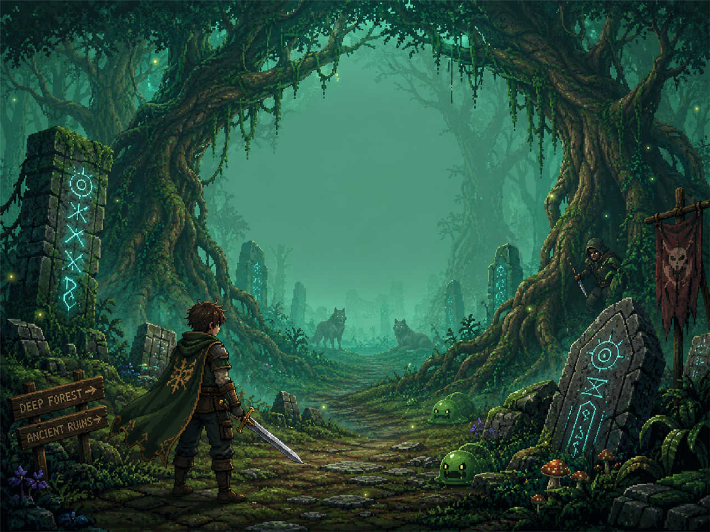
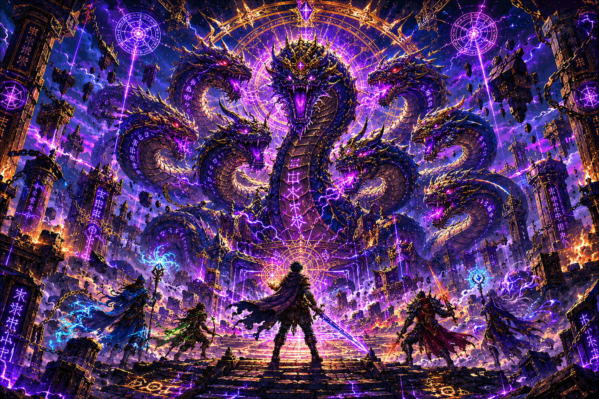
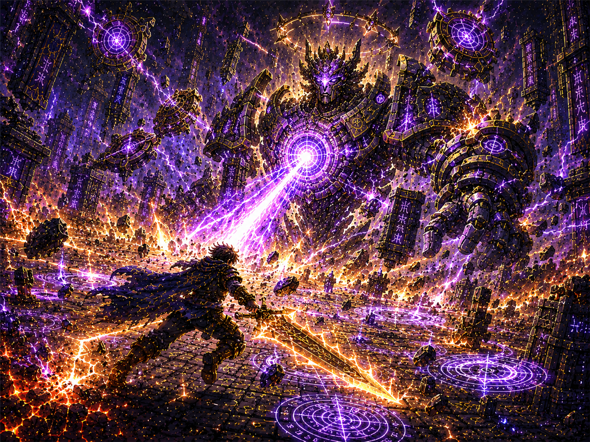

<p align="center">
  
</p>

<h1 align="center">像素探路者 · Pixel Pathfinder</h1>
<p align="center">v4.0 无尽远征版 — 节点式地图探索 · 回合制战斗 · 装备驱动成长</p>

一款 Godot 4.x 的 2D 像素风回合制 Roguelite：自由选关探索 + 回合制战斗 + 装备构筑 + 无限周目。

## 游戏画面 / Gallery

<p align="center">
  
  
  
</p>

## v4.0 无尽远征版改动一览

**美术（程序化像素，运行时合成 `scripts/fx/pixel_art.gd`）**
- 英雄整体外观随装备实时变化：武器握在手中（短剑/巨剑/战斧/长弓/劲弩…各有形态）、护甲改变躯干样式与头盔（布甲/皮甲/锁子甲/板甲/龙鳞甲），重甲附盾与盔缨，饰品在胸前发光，弓手背箭袋
- 15 种怪物 + 5 首领全部重绘为高细节 2 帧精灵：灰狼四足鬃毛、蝎子双螯卷尾、木乃伊绷带幽瞳、构造体浮空符文、雪人长臂毛绒、首领各有专属造型
- 100 件装备各有像素图标（基底形状 × 五行配色），背包/商店/图鉴/HUD 全部使用

**装备库（`scripts/data/item_catalog.gd`，共 100 件）**
- 20 个基底 × 金木水火土 = 100 件命名装备，各带品级（随区域/周目解锁）、基底特性与来历文案，全部收录图鉴
- 武器职业差异：剑无冷却 / 斧 ×1.55 攻击后冷却 1 回合 / 弓每回合两箭（每箭独立触发特效）
- 套装：同前缀 2/3 件激活（12 套：风暴连击、灰烬灼烧、皇家全能…）
- 词条 12→21 个，可组流派：吸血流 / 连击眩晕流 / 斧蓄势一击流 / 棘甲反伤坦克

**五行元素**
- 金克木·木克土·土克水·水克火·火克金；克制 ×1.3 被克 ×0.8（武器与护甲双向生效）
- 每元素独特触发：锐金破盾 / 回春吸血 / 缠流减攻 / 引燃灼烧 / 厚土成盾

**怪物系统**
- 基础怪自带特色能力（构造体坚甲、幽魂穿甲、冰灵虚体、熔岩怪荆棘…）+ 随机词条组合成 n 多变种（11 种词条），周目越高词条越多
- 整体数值增强；战斗界面显示元素/词条标签与灼烧/眩晕/减攻状态

**冷却机制**
- 防御冷却 2 回合（不能无脑堆盾）、药水战斗内冷却 3 回合、盾击 3、斧攻击 1；按钮实时显示冷却数

**无限循环 + 自由选关**
- 通关 5 区不再删档：进入「强化周目」无限循环（怪物 +55%生命/+45%攻击每周目，装备/金币掉落同步提级）
- 地图改为元气骑士式自由选关：13 个节点随时可进，收集完资源再挑战首领（或直奔首领）
- 进战斗节点前可侦察：怪物数量、词条、五行、精确生命/攻击（预览即实战）

**熔炼与锻打**
- 史诗+装备可熔炼：自选萃取其一条词条为「词条精华」（上限 6 个）
- 锻打：花费金币把精华赋予任意装备（单件词条上限 4 条，不可重复）——自由定制构筑

**商店**
- 扩充到 5 件商品（武/防/饰必各 1），新增「详情」界面看完整词条解说再买

## v3.0 远征加强版改动一览

**存档**
- 3 个存档位，标题画面可载入/删除/切换；进度随时自动保存（进节点前快照 + 地图态实时保存 + 关窗自动保存），任何时候退出都能继续
- 旧版单存档自动迁移到存档位 1

**界面与修复**
- 栈式弹窗：奖励/商店/事件界面上可叠加打开背包、图鉴、属性查看，关闭后恢复原界面（修复"战利品界面点背包后战利品消失卡死"）
- 修复全屏遮罩从未渲染、弹窗期间可误点底层按钮的布局缺陷（`set_anchors_preset` → `set_anchors_and_offsets_preset`）
- 新增图鉴（装备/怪物/首领/事件/药水 五分页详解）、属性面板（基础+装备+祝福=总计 分解）、存档位管理、区域选择界面
- 敌人血条显示精确数值；战斗按钮文字随武器变化

**装备**
- 每件装备附带解说词条（名称来历 + 器物来历 + 工艺轶事 + 传说逸闻），稀有度越高词条越多
- 稀有度严格分层：传说 > 史诗 > 稀有 > 普通（属性区间不重叠；词条数 3/2/1/0）
- 强化投入全程记录，出售时按投入的 50% 返还；强化预览（悬停强化按钮可见属性变化）
- 药水增加效果说明与来历

**掉落与难度**
- 普通怪低爆率（30% + 区域加成）、精英 100% 掉稀有+、首领 100% 掉史诗+

**地图与事件**
- 全部 5 个区域开局即开放，可任选区域出发或途中换区（推荐 1→5，方便调试）
- 随机事件池扩充到 18 个（带权重随机结果、金币/药水门槛），且不与最近遇到的事件重复

**战斗表现**
- 英雄手持武器随装备实时变化（剑/弓/斧图标），护甲稀有度脚底光环
- 武器差异化攻击：剑突进+斩击弧光 / 斧重劈回旋 / 弓后撤射出箭矢投射物
- 命中火花粒子、暴击震屏、受击后仰、阵亡倾倒下沉、血条平滑过渡

## v2.0 加强版改动一览

**画面**
- 全新程序化像素美术：5 张 1280×720 区域背景（抖动渐变天空、双层山脊景深、群系装饰、日月星云）
- 英雄 4 帧动画（待机×2 / 攻击 / 受伤），15 种敌人 + 5 个区域首领各 2 帧待机动画
- 每个区域专属天气粒子：落叶萤火 / 沙尘 / 雪花 / 余烬 / 神秘光尘
- 内置中文像素 UI 字体（文泉驿微米黑），统一深色像素风主题
- 攻击突进、受击白闪、死亡淡出、漂浮伤害数字、屏幕震动、弹窗弹入动画

**游戏完整性（此前缺失，全部补齐）**
- 商店 / 背包 / 宝箱 / 随机事件 / 战斗奖励 / 区域通关 / 胜利 / 失败 / 帮助 / 装备详情 共 10 类弹窗
- 标题画面（继续远征 / 新远征 / 帮助 / 退出）
- JSON 自动存档（进入节点、过区、阵亡后自动写入 `user://`，胜利后清档）
- 战斗目标选择（点击敌人切换攻击目标）、敌人逐个行动节奏
- 程序化合成音效 14 种 + 环境风声循环（零外部音频文件），可一键静音
- 本局统计（击杀/伤害/金币/节点），胜利与失败结算展示
- 快捷键：1-4 战斗动作，B 背包，Esc 关闭弹窗

**逻辑修复**
- 护符 +5 战斗回血重复触发 → 只触发一次
- 敌人数量 roll 永远无法出 3 个敌人 → 修正概率分支（15% 三敌 / 45% 双敌 / 40% 单敌）
- 区域祭坛祝福（攻击 +15%）被双重叠加 → 统一在装备结算中应用一次
- 清理全部孤儿脚本/场景与失效引用

## 操作说明

| 界面 | 操作 |
| --- | --- |
| 标题 | 继续远征（有存档时显示）/ 开始新远征（任选区域）/ 存档位 / 图鉴 |
| 地图 | 所有节点自由点击；战斗节点先侦察再进入；顶栏药水回血、"换区"随时切换 |
| 战斗 | 攻击[1] · 盾击[2]（冷却3）· 防御[3]（冷却2）· 药水[4]（冷却3）；点击敌人选目标 |
| 装备 | 右侧装备栏查看/强化；B 背包：装备/强化/出售/熔炼/锻打 |
| 快捷键 | B 背包 · C 图鉴 · V 属性 · Esc 关闭弹窗 · 1-4 战斗动作 |

+3 解锁被动，+5 解锁独特效果；阵亡损失一半金币但装备保留；通关进入强化周目无限循环。

## 开发自检

```
# 逻辑冒烟测试（headless，自动备份/恢复存档）
godot --headless --path . res://test/smoke_test.tscn
# 界面截图自检（输出到 test/shots/）
godot --path . res://test/shot_test.tscn
```

## 项目结构

```
├── project.godot              # 项目配置（4 个 autoload：GameState/GameData/SignalBus/Sfx）
├── scenes/main.tscn           # 唯一场景：根 Control，UI 全部由脚本程序化构建
├── scripts/
│   ├── main.gd                # 主控制器：视图切换/战斗生命周期/震动/Toast/快捷键
│   ├── game_data.gd           # 全部平衡数据与定义
│   ├── game_state.gd          # 运行时状态 + JSON 存档系统
│   ├── signal_bus.gd          # 全局信号总线
│   ├── sfx.gd                 # 程序化音效合成（autoload）
│   ├── ui_theme.gd            # 主题/字体/样式
│   ├── combat/                # 战斗状态机、伤害计算（五行/词条）、怪物构建
│   ├── data/                  # 100 件装备图鉴库、解说词条库
│   ├── equipment/             # 装备工厂、属性结算（套装/词条）、掉落
│   ├── map/                   # 自由选关地图生成（含怪物预掷）
│   ├── ui/                    # title/map/combat 视图 + HUD + 弹窗层
│   └── fx/                    # 程序化像素美术 pixel_art.gd + 天气粒子
└── assets/
    ├── backgrounds/           # 5 张区域背景
    ├── sprites/               # 英雄/15 敌人/5 首领/15 图标
    └── fonts/                 # 中文 UI 字体
```

## 运行 / 导出

见 `EXPORT_GUIDE.md`。最快方式：Godot 4.3 编辑器导入本目录 → F5 运行。

## 作者 / Authors

- **胡济舟 (Jizhou Hu)** — 程序 / 代码撰写 (Programming & Code)
- **崔鹤缤 (Hebin Cui)** — 策划 / 游戏设计 (Game Design & Planning)
