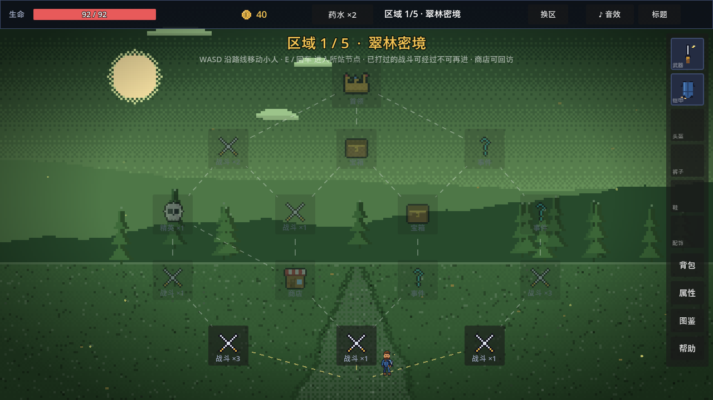
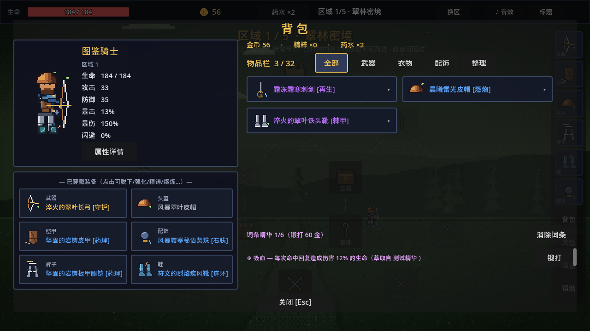
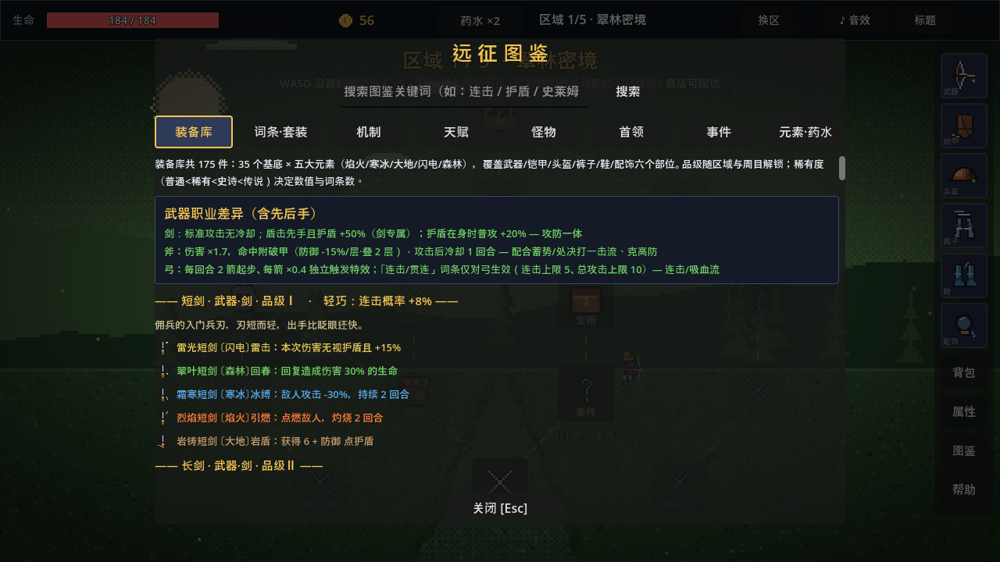

<p align="center">
  
</p>

<h1 align="center">Pixel Pathfinder</h1>

<p align="center">
  Plan routes, fight turn-based battles, and refine a build across increasingly difficult expedition cycles.
</p>

<p align="center">
  <a href="https://github.com/hujizhou35-cmd/pixel-pathfinder/releases/latest"></a>
  
  
  <a href="LICENSE"></a>
</p>

<p align="center">
  <a href="README.md">简体中文</a> · <strong>English</strong> ·
  <a href="https://github.com/hujizhou35-cmd/pixel-pathfinder/releases">All releases</a>
</p>

## About

Pixel Pathfinder is a turn-based pixel roguelite built with Godot 4.3. Scout and traverse node-based routes, manage supplies through shops and events, collect equipment in combat, and challenge each region's boss. Completing all five regions begins a stronger expedition cycle without discarding the build you assembled.

**Choose a route → Fight → Collect gear → Refine the build → Defeat a boss → Enter a stronger cycle**

## Core systems

| System | Role in the expedition |
|---|---|
| Route exploration | Move, backtrack, and scout encounters across a persistent node map. |
| Turn-based combat | Attack, shield bash, guard, and use potions with distinct timing and cooldown rules. |
| Equipment builds | Combine 175 catalogued items across six slots with rarity, upgrades, affixes, sets, forging, and refinement. |
| Elements and cycles | Five interacting elements add combat effects while later cycles strengthen both enemies and rewards. |

Three automatic save slots preserve long expeditions. A new run includes character naming and starting talent allocation.

## Screenshots

| Route map | Combat |
|---|---|
|  |  |

| Inventory | Searchable codex |
|---|---|
|  |  |

## Download

Open the [latest release](https://github.com/hujizhou35-cmd/pixel-pathfinder/releases/latest):

- `PixelPathfinder-v2.0.0-Windows-x64.exe` is the portable Windows 10/11 x64 build.
- `PixelPathfinder-v2.0.0-Full.zip` contains the same executable, complete Godot source, documentation, and licenses.
- `SHA256SUMS.txt` contains integrity hashes.

The executable is not code-signed, so Windows SmartScreen may display a warning.

## Run from source

Use Godot **4.3 stable**:

```powershell
git clone https://github.com/hujizhou35-cmd/pixel-pathfinder.git
cd pixel-pathfinder
godot --editor project.godot
```

See [`docs/BUILDING.md`](docs/BUILDING.md) for tests and exports, [`docs/GAMEPLAY.md`](docs/GAMEPLAY.md) for the mechanics, and [`docs/VERSION_HISTORY.md`](docs/VERSION_HISTORY.md) for the reconstructed release history.

## License

Project code and project-specific assets are available under the [MIT License](LICENSE). Godot and bundled font notices are documented in [THIRD_PARTY_NOTICES.md](THIRD_PARTY_NOTICES.md).
