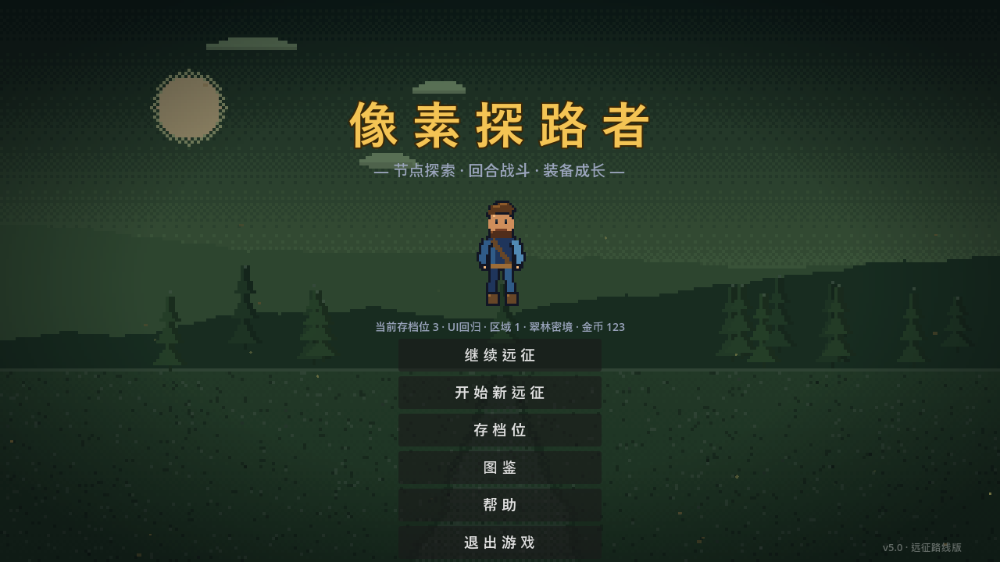
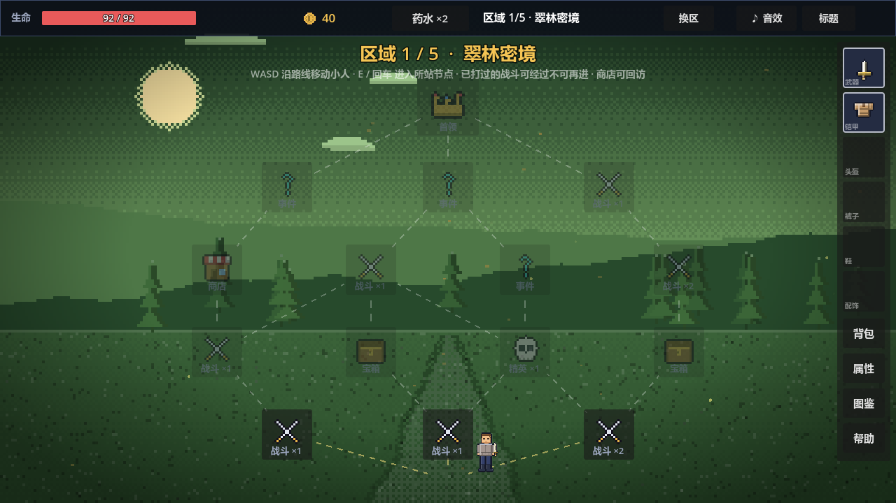
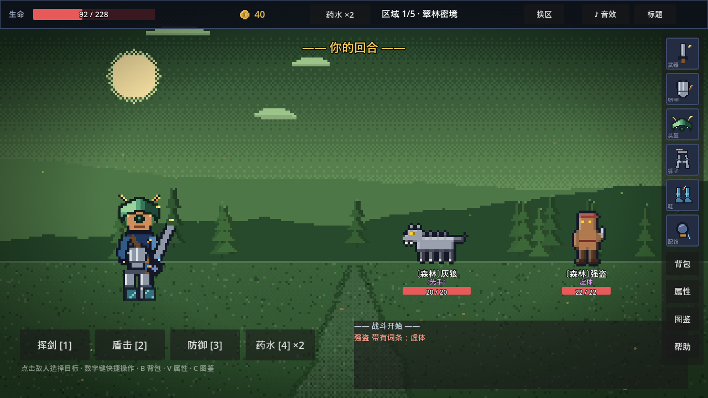
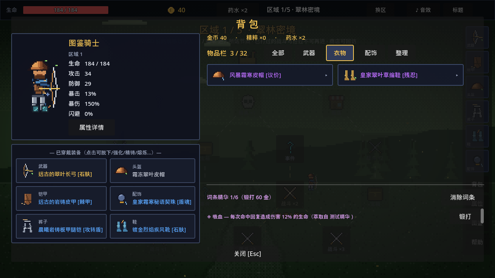
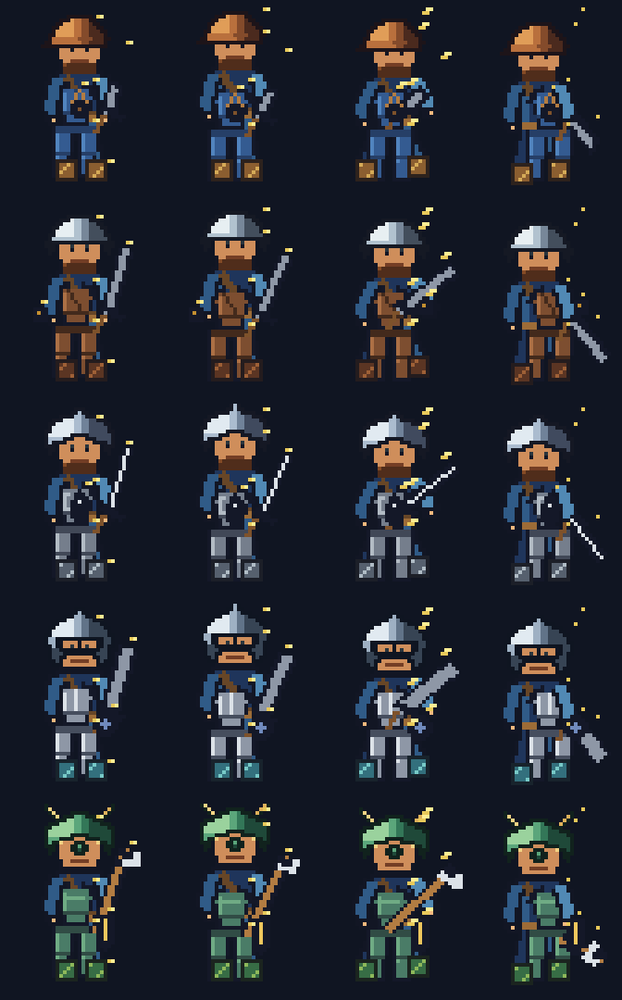

<p align="center">
  
</p>

<h1 align="center">像素探路者 · Pixel Pathfinder</h1>

<p align="center">
  一款融合路线选择、回合制战斗、装备构筑、五行区域与无限强化周目的像素 RPG。
</p>

<p align="center">
  <a href="https://github.com/hujizhou35-cmd/pixel-pathfinder/releases/tag/v2.0.0"></a>
  
  
  <a href="LICENSE"></a>
</p>

<p align="center">
  <a href="README.md">English</a> · <strong>简体中文</strong> ·
  <a href="https://github.com/hujizhou35-cmd/pixel-pathfinder/releases/latest">最新版本</a>
</p>

## 下载并运行

1. 打开 [v2.0.0 Release](https://github.com/hujizhou35-cmd/pixel-pathfinder/releases/tag/v2.0.0)。
2. 下载 `PixelPathfinder_v2.0.0_Windows_x64.zip`。
3. 使用 `SHA256SUMS.txt` 校验文件，解压后双击
   `PixelPathfinder_v2.0.0_Windows_x64.exe`。

发行包适用于 Windows 10/11 x64，无需安装；PCK 已嵌入 EXE，不会附带
独立 `.pck` 文件。

> 版本说明：`v2.0.0` 是 GitHub 对外发行版本。标题画面中的
> `v5.0 · 远征路线版` 是既有游戏内容版本标识，本次按要求保持不变。

## 游戏内容

- 在五大区域的节点地图中选择路线，可折返、侦察、进入商店与事件，并挑战精英和首领。
- 使用攻击、盾击、防御、药水进行回合战斗。
- 收录 175 件图鉴装备、六个装备部位、稀有度、强化、词条、熔炼、锻打和五行克制。
- 新档可分配天赋点；里程碑奖励天赋词条；通关后进入持续强化的无限周目。
- 三个存档位与自动保存，阵亡仍保留装备。
- 图鉴支持装备、词条、怪物、首领、事件、元素与机制检索。

## v2.0.0 界面修复

- 标题页完整六按钮组（含“退出游戏”）在有档/无档时都不会超出 1280×720
  逻辑画布。
- Help 弹窗改为固定标题、独立滚动正文、固定 `关闭 [Esc]` 按钮。
- 支持滚轮、方向键、`PageUp` / `PageDown`、`Home` / `End` 滚动。
- Help 叠加到其他弹窗后，关闭时仍会正确恢复底层弹窗。
- 真实窗口回归覆盖 1280×720、1366×768、1600×900、1920×1080。

## 修复后真实运行截图

以下均为修复后 Godot 运行时截图；顶部 Banner 就是真实标题画面。

| 标题页 | 路线地图 |
|---|---|
|  |  |

| 回合战斗 | 背包 |
|---|---|
|  |  |

| 可搜索图鉴 | 装备界面 |
|---|---|
|  |  |

<p align="center">
  
</p>

## 操作

| 场景 | 按键 |
|---|---|
| 地图 | `WASD` / 方向键移动，`E` / `Enter` / `Space` 进入节点 |
| 战斗 | `1` 攻击，`2` 盾击，`3` 防御，`4` 药水 |
| 全局 | `B` 背包，`C` 图鉴，`V` 属性，`Esc` 关闭/返回 |
| Help | 滚轮、方向键、`PageUp` / `PageDown`、`Home` / `End` |

## 从源码运行与构建

需要 Godot **4.3 stable**；Windows 导出还需要匹配的 x64 Export Templates。

```powershell
git clone https://github.com/hujizhou35-cmd/pixel-pathfinder.git
cd pixel-pathfinder
godot --editor project.godot
```

一键执行烟测、视觉测试、x64 单 EXE 导出和 Release 资产封装：

```powershell
.\build_windows.ps1 -GodotExe "C:\path\to\Godot_v4.3-stable_win64_console.exe"
```

输出：

- `release/PixelPathfinder_v2.0.0_Windows_x64.exe`
- `release/PixelPathfinder_v2.0.0_Windows_x64.zip`
- `release/SHA256SUMS.txt`

专项 UI 回归：

```powershell
godot --path . res://test/v2_ui_test.tscn
```

## 验证结论

- V2 UI 回归：**97 项断言全部通过**。
- 完整逻辑烟测：全部检查通过。
- 受保护的战斗、装备、数据、存档脚本：**0 个哈希差异**。
- 发行校验覆盖 x86_64 PE、嵌入式 PCK、Windows 文件/产品版本
  `2.0.0.0`、SHA-256、ZIP 结构与标签源码净环境启动。
- 详细证据位于 [`audit/`](audit/) 与 [`docs/`](docs/)。

## 团队

- **Jizhou Hu** — programming code — China Medical University
- **Hebin Cui** — game design planning — China Medical University
- **Chengyao Zhu** — programming code — Dalian University of Technology

## 许可证与第三方组件

项目代码及项目专用资产以 [MIT License](LICENSE) 发布。

Windows EXE 包含 MIT 许可的 Godot Engine 运行时，并嵌入采用 Apache-2.0
的 WenQuanYi Micro Hei 0.2.0-beta。版权、上游原文、文件哈希与审计范围
见 [THIRD_PARTY_NOTICES.md](THIRD_PARTY_NOTICES.md) 和
[`licenses/`](licenses/)。
